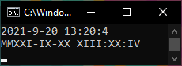

# RTClock
Python 3 Roman Numeral Real Time Clock

This was kind of an excuse for me to learn roman numerals higher than 10 
And made me write a decimal to roman number convertor (not a very good one)